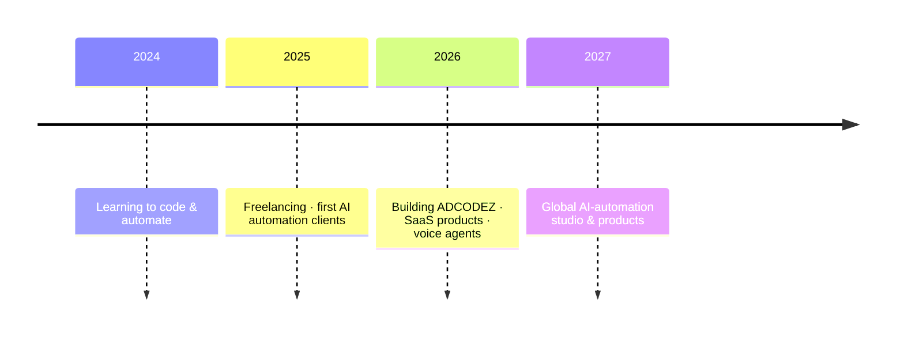

<div align="center">

<picture>
  <source media="(prefers-color-scheme: dark)" srcset="./assets/hero-dark.svg" />
  <source media="(prefers-color-scheme: light)" srcset="./assets/hero-light.svg" />
  
</picture>

<p></p>

<!-- Profile Meta Badges -->
<a href="https://github.com/ankushcodez"></a>
<a href="https://github.com/ankushcodez?tab=followers"></a>


</div>

---

## 👋 About Me

```yaml
name:        Ankush Mehra
role:        AI Automation Engineer & SaaS Builder
founder:     ADCODEZ  # AI automation studio
based_in:    India 🇮🇳
i_build:     AI automation systems, voice agents, and SaaS products
philosophy:  "Replace repetitive work with AI — ship products, not clones."
```

I'm an **AI Automation Engineer** who turns manual, repetitive business processes into **autonomous AI systems** — lead generation, voice agents, CRMs, and full-stack SaaS. I run **ADCODEZ**, where I build automation that actually ships and makes money.

- 🤖 I design **multi-agent AI systems** and **n8n workflows**
- 📞 I build **voice AI agents** (Retell / Vapi / OpenAI)
- 🧰 I ship **full-stack SaaS** with React, Next.js, TypeScript & Node
- 🌱 Currently going deeper into **Agentic AI & LangGraph**

---

## 🏅 GitHub Achievements

<div align="center">


*Collecting all GitHub Achievement badges 🏆*

</div>

---

## 🚀 Featured Projects

| Project | What it is | Stack |
|---------|-----------|-------|
| [**AgencyOS AI**](https://github.com/ankushcodez/agencyos-ai) | Operating system for AI-automation agencies | Next.js 16 · Firebase · TS |
| [**AI Marketing System**](https://github.com/ankushcodez/ai-marketing-system) | Full-stack digital-marketing automation platform | React · TanStack · Supabase |
| [**AI Social Media Manager**](https://github.com/ankushcodez/ai-social-media-manager) | 6 AI agents that run your socials end-to-end | Node · Multi-Agent · Ollama |
| [**AI-Attend**](https://github.com/ankushcodez/ai-attend) | Face-recognition + GPS attendance & payroll | HTML · JS · GSAP |
| [**Real-Estate AI OS**](https://github.com/ankushcodez/realestate-ai-architecture) | Speed-to-lead automation architecture & case study | n8n · Meta CAPI · Airtable |

> 🔒 Selected commercial products (a client CRM and an accounting SaaS) are kept in private repos.

---

## 🛠️ Tech Stack

**Languages**


**Frameworks & Runtime**


**AI & Automation**


**Data & Cloud**


**Tools & Platforms**


---

## 📊 GitHub Analytics

<div align="center">


</div>

### 🐍 Contribution Snake

<div align="center">


</div>

---

## 🎯 Current Focus

```text
Building:
  - AgencyOS AI ............ operating system for AI agencies
  - AI Voice Agents ........ Retell / Vapi calling systems
  - Client automation ...... lead-gen + outreach pipelines

Learning:
  - Agentic AI & LangGraph
  - Advanced n8n orchestration
  - Cloud scaling (Docker / Kubernetes)

Scaling:
  - ADCODEZ → a global AI-automation studio
```

---

## 🗺️ The Journey



---

## ⚡ Fun Facts

- ☕ Best automations get built at 2 AM
- 🤖 I'd rather spend 4 hours automating a 10-minute task (and I'll do it again)
- 🚀 I build **products**, not clones
- 🎙️ My AI voice agents make calls so I don't have to

---

## 🤝 Connect With Me

<div align="center">

<a href="mailto:ankush.codez@gmail.com"></a>
<a href="https://www.linkedin.com/in/adcodez/"></a>
<a href="https://www.instagram.com/ANKUSH.CODEZ"></a>

</div>

<div align="center">
<sub>💜 Building the future of work, one automation at a time.</sub>
</div>
